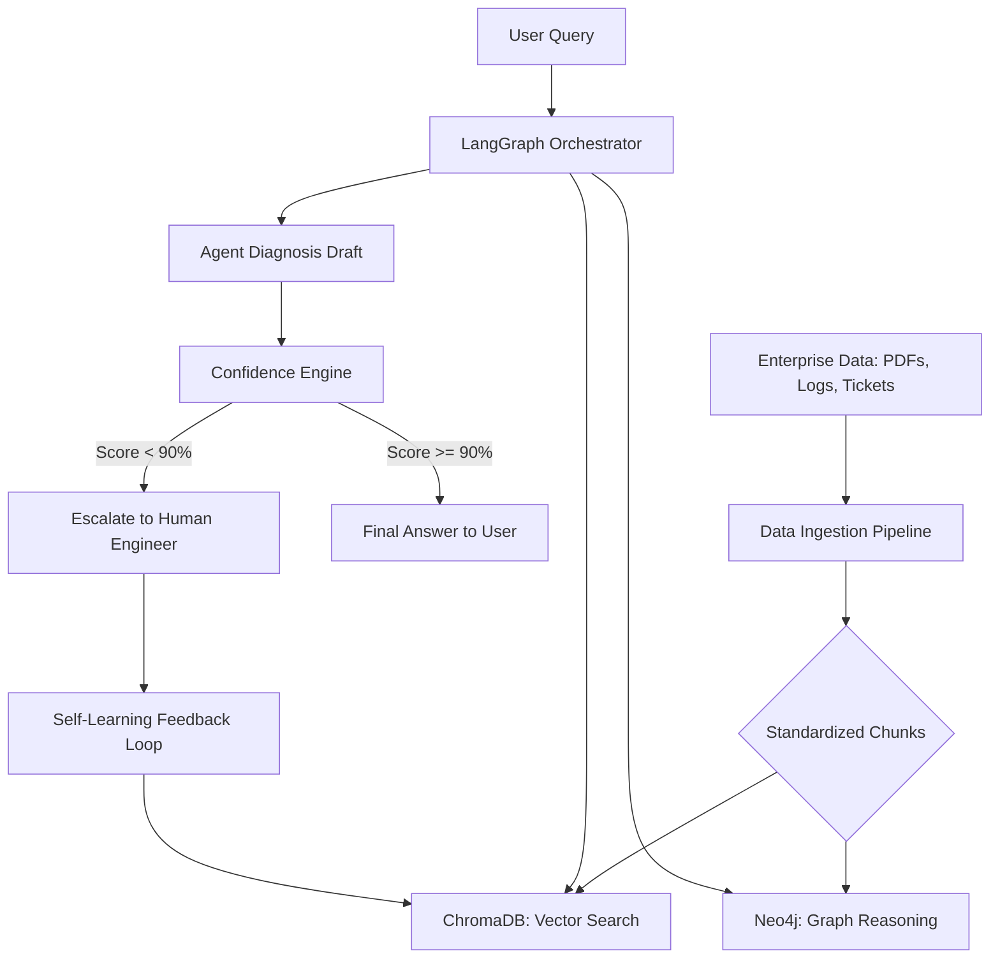

# 🚀 Enterprise Knowledge Copilot

[](https://www.python.org/downloads/)
[](https://github.com/langchain-ai/langgraph)
[](https://fastapi.tiangolo.com/)

**Enterprise Knowledge Copilot** is a state-of-the-art multi-agent orchestration pipeline designed to revolutionize IT support and enterprise knowledge retrieval. By combining semantic vector search, relational graph reasoning, and a trust-gated evaluation engine, it delivers high-fidelity resolutions to complex system queries while ensuring safety through human escalation.

---

## 🏗️ System Architecture



---

## ✨ Key Features

*   🤖 **Intelligent Multi-Agent Orchestration**: Powered by **LangGraph**, the system dynamically routes queries between documentation search and relationship tracing.
*   🗄️ **Hybrid Retrieval (RAG)**: Combines **ChromaDB** (semantic context) and **Neo4j** (relational context) for a 360-degree view of enterprise data.
*   🔐 **Trust-Gated Evaluation**: Built-in **Confidence Engine** evaluates LLM responses; only high-confidence answers are served, while others are escalated.
*   📚 **Self-Learning Feedback Loop**: Captures human-verified resolutions and automatically re-ingests them to improve future performance.
*   🚀 **Production-Ready API & UI**: Served via **FastAPI** with a user-friendly **Gradio** interface for seamless interaction.
*   ⚡ **Local-First Performance**: Uses local HuggingFace embeddings to minimize latency and cloud dependencies.

---

## 📁 Project Structure

| Module | Responsibility | Contributor |
| :--- | :--- | :--- |
| `ingestion_pipeline/` | Document parsing, cleaning, and chunking | Anshika |
| `vector_search/` | Local vector embedding and semantic retrieval | Rhythm |
| `graph_reasoning/` | Neo4j graph construction and multi-hop tracing | Yash |
| `agent.py` | LangGraph orchestration and tool routing | Arpan |
| `confidence_engine/` | Trust-gating and confidence scoring | Mohit |
| `backend_api/` | FastAPI endpoints and Gradio UI | Integration Team |

---

## 🚀 Quick Start

### 1. Prerequisites
*   **Python 3.9+**
*   **Neo4j Desktop** (Running local instance)
*   **Google Gemini API Key** (Get it [here](https://aistudio.google.com/))

### 2. Installation
```bash
# Clone the repository
git clone https://github.com/ANSHIKA1220/Enterprise-Knowledge.git
cd Enterprise-Knowledge

# Create and activate virtual environment
python -m venv venv
.\venv\Scripts\Activate.ps1

# Install dependencies
pip install -r requirements.txt
```

### 3. Configuration
Create a `.env` file in the root directory:
```env
GOOGLE_API_KEY="your_gemini_api_key"
LLAMA_CLOUD_API_KEY="your_llamacloud_api_key"
NEO4J_URI="bolt://localhost:7687"
NEO4J_USERNAME="neo4j"
NEO4J_PASSWORD="your_password"
CHROMA_PERSIST_DIR="./chroma_db"
```

### 4. Data Ingestion & DB Population
```bash
# Populate Vector and Graph Databases
python populate_dbs.py
```

### 5. Running the Application
```bash
# Start the FastAPI Backend
python -m uvicorn backend_api.main:app --host 0.0.0.0 --port 8000

# Start the Gradio UI (In a new terminal)
python backend_api/app_ui.py
```
Access the UI at `http://localhost:7860`.

---

## 🛠️ Technology Stack
*   **LLM**: Gemini 2.5 Flash
*   **Orchestration**: LangGraph, LangChain
*   **Databases**: ChromaDB (Vector), Neo4j (Graph)
*   **API Framework**: FastAPI
*   **Frontend**: Gradio
*   **Data Parsing**: LlamaParse, PyMuPDF

---

## 📊 Status & Roadmap
*   ✅ **Phase 1**: Core Ingestion & Retrieval (Complete)
*   ✅ **Phase 2**: Multi-Agent Orchestration & Trust-Gating (Complete)
*   ✅ **Phase 3**: Integration & UI (Complete)
*   ⏳ **Phase 4**: Real-time log monitoring integration (Planned)
*   ⏳ **Phase 5**: Multi-modal document support (Planned)

---

## 👥 Contributors
*   **Arpan Mathur** - Multi-Agent Orchestration
*   **Anshika** - Data Ingestion Pipeline
*   **Yash Pratap Singh** - Graph Reasoning Module
*   **Rhythm** - Vector Search Engine
*   **Mohit** - Confidence & Evaluation Engine

---

## 📄 License
This project is licensed under the MIT License.
